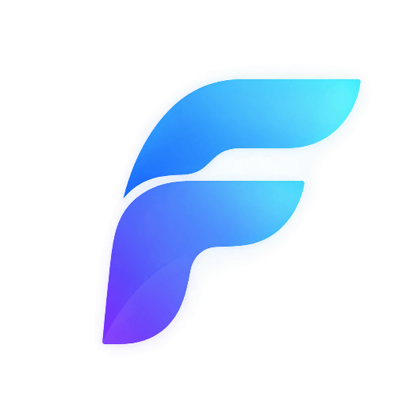

<!-- prettier-ignore -->
<div align="center">
  

  <h1>Farsi UI · فارسی یو آی</h1>
  <p><strong>An open-source, RTL-first component library for Persian React apps.</strong></p>
  <p>Copy the components you need, drop them into your project, and ship a polished Persian interface — without fighting RTL ever again.</p>

  <p>
    <a href="./README.md">English</a> ·
    <a href="./README.fa.md">فارسی</a>
  </p>

  <p>
    <a href="https://farsi.eindev.ir"></a>
    <a href="https://github.com/farsi-ui/ui"></a>
    
    
    
    
    
  </p>

  <p>
    <a href="#why">Why</a> ·
    <a href="#features">Features</a> ·
    <a href="#quick-start">Quick start</a> ·
    <a href="#components">Components</a> ·
    <a href="#blocks">Blocks</a> ·
    <a href="#design-system">Design system</a> ·
    <a href="#local-development">Develop</a>
  </p>
</div>

RTL is not a plugin you add at the end. It decides your layout primitives, your icon direction, your spacing scale, and how numbers and punctuation behave. Farsi UI starts from `dir="rtl"` and designs everything forward from there.

> [!TIP]
> This repository contains both the component source and the documentation website. Browse the live docs at **[farsi.eindev.ir](https://farsi.eindev.ir)** — every component page has a live preview and a copy button.

## Why

Most React UI kits assume left-to-right. That assumption leaks into spacing (`ml-4` instead of `ms-4`), arrows, slider direction, carousel behavior, form validation placement, and even animation easing. Farsi UI is built the other way around:

- **RTL-first, not RTL-patched.** Layouts use CSS logical properties, so the same markup works in both directions.
- **Persian typography handled.** Vazir is bundled locally, Vazirmatn is wired up in the guides, and headings get the `rlig`/`calt` OpenType features Persian needs.
- **Accessible by construction.** Every interactive component is built on Radix UI primitives, so focus management, keyboard support, and ARIA wiring come for free.
- **Yours to own.** No runtime dependency, no theme package, no black box. You get plain TypeScript files you can edit.

## Features

- **36 documented components** across inputs, display, feedback, navigation, layout, and overlay, with more in progress.
- **Copy-paste installation.** No `node_modules` bloat: copy the file, own the code.
- **Ready-made blocks** for authentication, dashboards, and forms, composed from the same primitives.
- **Moon design tokens** plus a **Material System** layer (Apple HIG / SwiftUI glass inspired) built on OKLCH.
- **Light and dark themes** with system preference support and smooth, transition-free switching.
- **RTL-aware everything** — logical properties, `rtl-flip` utility, `useIsRTL()`, and a Radix `DirectionProvider`.
- **Mobile-first details** — 44px touch targets, safe-area helpers, and bottom sheets and drawers tuned for small screens.
- **Reduced-motion aware** animations that disable themselves when the user asks.
- **SEO/AI friendly docs** — per-page metadata, JSON-LD, sitemap, `robots.txt`, and an `/llms.txt` feed.

## Quick start

### Requirements

- Node.js 18 or newer
- A Next.js project using the App Router (or any React project with Tailwind CSS v4)

### 1. Install the peer dependencies

```bash
npm install @radix-ui/react-slot class-variance-authority clsx tailwind-merge
```

### 2. Set the document direction and font

Your root layout must declare `lang="fa"` and `dir="rtl"`:

```tsx
import { Vazirmatn } from "next/font/google";

const vazirmatn = Vazirmatn({ subsets: ["arabic"] });

export default function RootLayout({ children }: { children: React.ReactNode }) {
  return (
    <html lang="fa" dir="rtl">
      <body className={vazirmatn.className}>{children}</body>
    </html>
  );
}
```

### 3. Add the `cn` helper

```ts
// lib/utils.ts
import { clsx, type ClassValue } from "clsx";
import { twMerge } from "tailwind-merge";

export function cn(...inputs: ClassValue[]) {
  return twMerge(clsx(inputs));
}
```

### 4. Copy a component

Open any component page, hit **Copy**, and paste the file into `components/ui/`. That is the whole installation flow.

```tsx
import { Button } from "@/components/ui/button";

export default function App() {
  return <Button variant="primary">شروع کنید</Button>;
}
```

> [!NOTE]
> The landing page also shows a registry shortcut — `npx shadcn@latest add @einui/react` — for teams that prefer the CLI. Manual copy-paste is the canonical path and works with any setup, including projects that are not shadcn-initialised.

Full walkthrough: **[farsi.eindev.ir/docs/installation](https://farsi.eindev.ir/docs/installation)**.

## Components

Six categories, 36 documented components. Every page includes live previews, variants, the full source, and the exact dependencies.

| Category | Components |
| --- | --- |
| **Inputs** | Button · Text Input · Text Area · Checkbox · Radio Button · Switch · Select · Range Input · Search · Multi Select · Field |
| **Display** | Avatar · Tag · Chips · Card · Table · Tooltip |
| **Feedback** | Progress · Loader · Snackbar · Skeleton · Banner · Empty State |
| **Navigation** | Tabs · Breadcrumb · Pagination · Bottom Navigation · Menu Item |
| **Layout** | Accordion · Carousel |
| **Overlay** | Dropdown Menu · Drawer · Modal Dialog · Alert Dialog · Popover · Bottom Sheet |

The source directory holds more than the documented set — 56 primitives in total, including sidebar, charts, calendar, command palette, OTP input, resizable panels, and toasts. See [`components/ui`](./components/ui) for the full list.

## Blocks

Blocks are pre-composed, real-world sections. Copy one and you have a working login screen or dashboard panel instead of a blank canvas.

| Category | Blocks |
| --- | --- |
| **Authentication** | Simple Login Form · Social Login Form · Signup Form |
| **Dashboard** | Stats Cards · Recent Sales |
| **Forms** | Contact Form |

Sources live in [`components/blocks`](./components/blocks) and are indexed in [`lib/blocks-data.tsx`](./lib/blocks-data.tsx).

## Design system

Farsi UI ships two token layers, both expressed in OKLCH so light and dark stay perceptually consistent.

**Moon tokens** — the base palette, named after Dragon Ball characters so the scale is memorable: `piccolo` (primary), `hit`, `frieza`, `roshi`, `krillin`, `whis`, `chichi`, `dodoria`, plus neutrals like `trunks`, `beerus`, `gohan`, and `goku`.

```css
--piccolo: 250 90% 62%; /* brand */
--hit: 174 60% 50%; /* secondary */
--beerus: 240 6% 92%; /* borders and surfaces */
```

**Material tokens** — a newer layer modeled on Apple's Human Interface Guidelines and SwiftUI glass materials (`regular`, `clear`, `tint`, `interactive`), built on `backdrop-filter` and `color-mix()` with `color-scheme` support.

```css
--material-glass-fallback-regular: rgb(255 255 255 / 0.68);
```

RTL utilities are part of the system, not an afterthought:

- `rtl-flip` — mirrors an icon only when the document is RTL
- `useIsRTL()` — reads the live `dir` attribute for conditional logic
- `touch-target` / `safe-area-*` — 44px minimums and notch-safe padding
- `prefers-reduced-motion` — animation utilities switch themselves off

> [!IMPORTANT]
> Glass components (Material System) are **in active development**. The primitives and tokens are in the repository, and the preview page is at [/glass-components](https://farsi.eindev.ir/glass-components).

## Local development

The docs site *is* the development environment for the library, so you can change a component and see it live.

```bash
git clone https://github.com/farsi-ui/ui.git
cd ui
pnpm install

pnpm dev     # start the docs site on http://localhost:3000
pnpm lint    # ESLint
pnpm build   # production build
pnpm start   # serve the production build
```

| Script | What it does |
| --- | --- |
| `pnpm dev` | Next.js dev server with hot reload |
| `pnpm lint` | ESLint across the repository |
| `pnpm build` | Production build |
| `pnpm start` | Serve the production build |

### Environment variables

| Variable | Default | Purpose |
| --- | --- | --- |
| `NEXT_PUBLIC_SITE_URL` | `https://farsi.eindev.ir/` | Canonical URL for metadata, sitemap, and `robots.txt` |
| `GOOGLE_SITE_VERIFICATION` | — | Google Search Console token |

Copy `.env.local.example` to `.env.local` for local development.

### Project structure

```
app/                  Routes: landing page, /docs, /glass-components, /llms.txt, sitemap, robots
  docs/               Documentation: getting started, foundations, components, blocks
components/
  ui/                 56 UI primitives (shadcn-style, Radix-based)
  blocks/             Pre-composed sections: auth, dashboard, forms
  glass/              Glass / Material System components (in development)
  docs/               Docs chrome: sidebar, header, previews, install blocks
lib/                  Component and block registries, Shiki highlighter, cn() helper
hooks/                use-rtl, use-mobile, use-toast
styles/               globals.css plus the Moon and Material token layers
public/fonts/         Vazir (400/700) served locally
```

Adding a component means adding the file, then registering it in [`lib/components-data.tsx`](./lib/components-data.tsx) with its category, examples, dependencies, and source path — the docs page, sidebar, search, sitemap, and `/llms.txt` feed are all generated from that registry.

## Deployment

A multi-stage [`Dockerfile`](./Dockerfile) builds on `node:20-alpine` with pnpm, ships only the production dependencies, and runs `next start` behind a health check on port 3000.

```bash
docker build -t farsi-ui .
docker run -p 3000:3000 farsi-ui
```

Publishing a GitHub release triggers the [`deploy`](./.github/workflows/deploy.yml) workflow, which builds the image on the target host and restarts the Compose stack. A [GitLab pipeline](./.gitlab-ci.yml) is included as well, with install, lint, test, and build stages.

## Show your work

Built something with Farsi UI? Open a discussion to get it featured on the landing page:

**[github.com/orgs/einlab/discussions](https://github.com/orgs/einlab/discussions)**

Questions, bugs, or accessibility reports all belong in the [issue tracker](https://github.com/farsi-ui/ui/issues) — dedicated templates for bugs, features, docs, and accessibility are ready to use.

---

<div align="center">
  <p>Built with care for Persian-speaking developers · <a href="https://eindev.ir">Ein</a></p>
</div>
